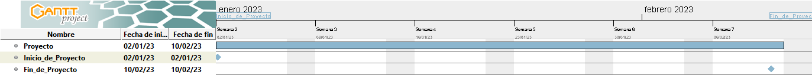

# Minería de reglas reglas de asociación espaciales sobre bloques de Minecraft #

## Búsqueda de patrones en el posicionamiento de bloques de Minecraft ##

## Código MINECRAFT_ASSO_MINING ##

***Martín Cogo Belver***

## Proyecto ##

Este proyecto se enfocara en la prueba de un algoritmo para inferencia de *reglas de asociación espacial* que ilustren los patrones de posicionamiento de objetos dentro de un escenario.
Para probar realizar las pruebas, el escenario elegido sera una parte de un mapa generado en Minecraft.  

Se buscaran reglas ilustren los patrones que existen entre los distintos bloques de un mundo generado de manera procedural del videojuego Minecraft.

Para la extracción de la información de los bloques del Juego se utilizara la biblioteca **Anvil** en Python. Como algoritmo para la inferencia de reglas se utilizara a el algoritmo **...**.

## Objetivos ##  

1. Detección de patrones evidentes y no tan evidentes dentro del escenario planteado

2. Corroborar que un acercamiento al problema de detección de patrones utilizando reglas de asociación es un buen camino

## Alcance y limitaciones ##

+ Para este proyecto se quiere evitar entrar en problemas de computer vision para la extracción de los datos de entornos.

+ También. de ser posible, se quiere evitar la necesidad de generación manual de datos para la resolución del problema.  

+ Tentativamente se podría generar un modelo evalué si se cumplen las reglas dentro de un entorno.  

## Métricas ##

+ Soporte: Mide la frecuencia con la que aparece en todas las transacciones.

$$
Support({X}\to{Y})  = \dfrac
{\text{Transaction containing X and Y}}
{\text{Total number of transactions}}
$$

+ Confianza: Mide la probabilidad de que aparezca el consecuente dado un antecedente.

$$
confidence({X}\to{Y})  = \dfrac
{\text{Transaction containing X and Y}}
{\text{Transactions containing X}}
$$

+ Sustentación: Calcula la probabilidad de ocurrencia del consecuente dado un antecedente.
$$
Lift({X}\to{Y})  =
\dfrac{
    \dfrac{\text{Transaction containing X and Y}}{\text{Transactions containing X}}
    }{
    \text{Fraction of transactions containing Y}
    }
$$

## Justificación ##

Actualmente existen varios algoritmos que permiten la generación procedural de posicionamiento de objetos dentro de un  entorno. Pero estos utilizan restricciones declaradas por el programador. Encontrar y declarar estas restricciones presenta una tarea compleja y esto no permite que el posicionamiento de los objetos dentro del escenario tengan mucha libertad o variación.  

Por ello la idea del proyecto sería encontrar una manera de automatizar la generación de restricciones que utilizaría un algoritmo de generación procedural para el posicionamiento de los objetos dentro del escenario.

De ahí que sea necesario la utilización de un algoritmo de machine learning para la deducción de estas reglas y detección de patrones. Ya que los escenarios contienen datos que pueden ser utilizados para la deducción de la relación espacial que existe entre los objetos que estos contienen.  

## Listado de actividades a realizar ##

1. Preprocesamiento de los datos iniciales para generar predicados espaciales que se utilizaran a la hora de realizar la inferencia.

2. Realizar gráficos de exploración de los datos de entrada y análisis.

3. Codificación del algoritmo para inferencia de reglas propuesto.

4. Realizar registro de las métricas particulares para evaluar las reglas de asociación obtenidas.

5. Realizar el informe final con diagramas y conclusiones.

## Cronograma Gantt estimado de actividades ##

