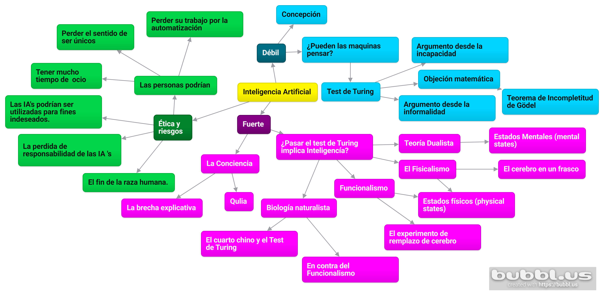

## **Martín Cogo Belver** ##

![][Logo de universidad]

# Inteligencia Artificial I

## Indice

1. Inteligencia Artificial *débil*
2. Inteligencia Artificial *fuerte*
3. La *ética* y los *riesgos* de desarrollar Inteligencia Artificial.
4. Mapa mental
5. Mi Opinión
6. Referencias
 
Inteligencia Artificial *débil*
===  
 
El campo de la Inteligencia Artificial fue definido bajo la siguiente afirmación:  
 
>"Todo aspecto de aprendizaje o cualquier otra característica de inteligencia puede ser descrita de forma precisa de tal manera que puede ser simulada".  
 
Por esto, el campo de la IA fue fundado bajo la suposición de que la ***IA débil*** era posible.
 
Se entiende la IA como la búsqueda del mejor agente dada una arquitectura. Esta definición funciona bien en el ámbito de la ingeniería, pero en el campo de la filosofía, los filósofos están interesados en un problema en particular.  
El problema es *comparar dos arquitecturas:* la ***humana y máquina***. De esto surge la pregunta: **¿Pueden las máquinas pensar?**.
 
***Alan Turing*** en su investigación *"Computing Machinery and Intelligence"* propone que, en vez de preguntarnos si las máquinas pueden pensar, deberíamos preguntarnos si son capaces de pasar un examen de comportamiento. A esto se le conoce como el **Test de Turing**.
 
**Turing** también examinó una gran variedad de posibles objeciones a la posibilidad de que las máquinas pueden pensar. Algunos argumentos son:
 
+ ### El argumento desde la incapacidad:
 
Este argumento hace uso de la afirmación
>" Una máquina nunca podrá hacer ***X*** "  
 
Como ejemplos de ***X*** **Turing* propuso:
>*Be kind, resourceful, beautiful, friendly, have initiative, have a sense of humor, tell right from wrong, make mistakes, fall in live, enjoy strawberries and cream, make someone, fall in love with it, learn from experience, use words properly, be the subject of its own thought, have as much diversity of behavior as man, do something really new.*
 
Con lo que sabemos sobre las computadoras no es sorprendente que puedan realizar tareas como o mejor que los humanos. Esto no significa que las computadoras utilicen **entendimiento** al realizar estas tareas, esto no es parte de su **comportamiento**. Este aspecto se trata con la explicación de **IA *fuerte***.
 
+ ### La objeción matemática:
 
Existen ciertas preguntas matemáticas que son en principio *irrespondibles* por sistemas formales en particular. **El teorema de incompletitud de Gödel** *(Incompleteness theorem)* es el ejemplo más famoso de esto.
 
El teorema plantea que para cualquier sistema axiomático formal ***F*** capaz de realizar operaciones aritméticas, es posible construir un **enunciado de Gödel** *(Gödel sentence)* **G(*F*)** con las siguientes propiedades:
 
> G(F) es un enunciado de F, pero que puede probarse sin F.  
 
>Si F es consistente, entonces G(F) es verdadero.  
 
Este teorema se ha utilizado como argumento para expresar y justificar que las máquinas son inteligentemente inferiores a los humanos.  
Pero se pueden examinar 3 problemas que trae esta afirmación:  
 
1. El **teorema de incompletitud de Gödel** Se aplica solo para sistemas formales que puedan realizar operaciones aritméticas. Esto incluye las *máquinas de Turing*.
Pero, las *máquinas de Turing* son teóricamente infinitas, mientras que las computadoras son finitas. Entonces toda computadora puede ser descrita entonces como un sistema en lógica proposicional, por lo que, no son aplicables al **Teorema de incompletitud de Gödel**.  
 
2. Un agente no debería no poder establecer el valor de verdad de una sentencia mientras que otros sí pueden.  
 
3. Incluso si podemos garantizar que las computadoras tienen limitaciones en lo que pueden realizar, no hay ninguna evidencia de que los humanos no tienen estas limitaciones tampoco.
Es imposible probar que **la teoría de incompletitud de Gödel** no es aplicable a humanos, debido a que cualquier prueba rigurosa requeriría la formalización de lo que se denominan talentos humanos formalizables.  
 
+ ### El argumento desde la informalidad:  
 
Una de las críticas más persistentes sobre la IA fue fundada por Turing como *"el argumento desde la informalidad"*.  
 
>La incapacidad de capturar todo en un conjunto de reglas lógicas se denomina como **qualification problem** en IA.  
 
El problema radica en las IA que están destinadas a tener un comportamiento inteligente a partir de un sistema que utiliza el razonamiento lógico sobre un conjunto de hechos y reglas descritas en un dominio.  
Estos sistemas son susceptibles al **qualification problem**.
 
Uno de los argumentos más fuertes de **Dreyfus** sobre las IA basadas en sistemas de inferencia lógica es sobre aquellas sin cuerpo físico. Planteando una comparación con el pensamiento lógico  humano, entiende que existe una desventaja para las IA al no poder percibir la realidad como lo hace el razonamiento biológico con un cuerpo.
 
Inteligencia Artificial *fuerte*
===
 
Muchos filósofos han declarado que si una máquina pasa el **Test de Turing** podría realmente no estar pensando, sino simulando pensar.
 
Existen críticas sobre que las máquinas para ser inteligentes deberían tener sentimientos e intencionalidades.
 
**Turing** respondió a estas críticas cuestionando la exigencia con respecto a las máquinas y haciendo analogía a los humanos, ilustrando cómo las personas, no se preguntan si cada ser humano realmente piensa, sino que se asume que todos pensamos.  
 
Aún así existen quienes creen que la IA nunca llegará a realmente pensar. Para poder determinar si una computadora realmente piensa es necesario resolver un hecho fundamental: *los humanos tienen mentes reales, y las máquinas pueden o no tenerla*.  
 
Para entender si una máquina puede pensar es fundamental resolver el problema de la mente y el cuerpo, esto implica un esfuerzo filosófico. De este esfuerzo han surgido distintas teorías:
 
+ **Teoría Dualista**: Plantea que la mente está separada del cuerpo. Esta teoría lleva a la pregunta de cómo la mente controla el cuerpo.
 
+ **Fisicalismo**: Evitando el problema de la teoría anterior. El Fisicalismo asume que la mente no está separada del cuerpo y que los estados mentales son estados físicos. Lo que trae el problema de explicar como un estado mental *(mental state)* es simultáneamente un estado físico *(physical state)*.
 
## Los estados mentales y el cerebro en un frasco  
 
Los filósofos fisicalistas han explicado el significado de que una persona se encuentre en un estado mental determinado enfocándose en los **estados intencionales**.  
 
Si el fisicalismo es correcto debe existir un caso en el que el estado mental de una persona está determinado por un estado físico (brain state). Si esto es así entonces existirían configuraciones en el cerebro de varias personas que correspondan con un mismo tipo de estado mental. El punto clave es que un estado físico no puede corresponder con otro estado mental.
 
Esta concepción sencilla ha llevado al experimento del cerebro en un frasco.  
 
Se supone que si se colocara un cerebro en un frasco y se conectara a un simulador en el cual se simulará el cuerpo,  entonces el cerebro podría tener un estado mental idéntico al de alguien que sí tiene un cuerpo real. Esto contradeciría que  el estado mental depende de un estado físico.
 
### El Funcionalismo y el experimento de remplazo de cerebro
 
La teoría del funcionalismo dice que un estado mental *(mental state)* Es cualquier condición intermedia entre una entrada y una salida. Y bajo esta teoría cualquier de los sistemas isomórficos tendrían los mismos estados mentales bajo la misma entrada.
 
Para ilustrar esta teoría está el experimento de reemplazo de cerebro. Supone que la tecnología ha avanzado lo suficiente como para reemplazar las neuronas individualmente de una persona por neuronas mecánicas. La cuestión es determinar si la conciencia de la persona continuará siendo idéntica a la de antes o si cambiara. Existen varias opiniones al respecto.
 
### La biología naturalista y el cuarto chino
 
La biología naturalista propone que las características de estados mentales de alto nivel son causados por procesos físicos de bajo nivel en las neuronas. Los estados mentales no pueden ser duplicados con un programa que tenga la misma funcionalidad estructural. Se requeriría que el programa se ejecutará en una arquitectura con las mismas capacidades neuronales. Esta teoría atenta contra la teoría funcionalista.
 
Para demostrar la mirada de esta teoría se describe un sistema hipotético que pasa el **Test de Turing** pero que no entiende nada de la entrada y la salida.
 
El sistema consiste en una persona que entiende sólo inglés en un cuarto que tiene las reglas para identificar símbolos chinos a partir de un papel con símbolos que se utiliza de entrada y escribir símbolos chinos en otro papel que será la salida.
 
Con este caso hipotético se busca ilustrar que correr un programa correctamente no implica entendimiento.  
 
De esto surgen 4 reglas:
 
1. Los programas de computadoras son formales. **(sintácticos)**  
2. Las mentes humanas tienen contenido mental. **(semánticos)**
3. La sintaxis por sí misma es constituyente y no suficiente para la semántica.
4. Los cerebros crean mentes.
 
Los primeros 3 axiomas concluyen que un agente corriendo un programa *puede* ser una mente, pero no es *necesariamente* por tener la virtud de ejecutar un programa.
 
Y del cuarto axioma sabemos que para que un cerebro artificial tenga que duplicar el poder causal de los cerebros, y no solo correr un programa en particular. y además, que el cerebro humano no produce intencionalidad únicamente por la virtud de ejecutar programas.
 
#### Conciencia, Qualia, y la Brecha Explicativa
 
Uno de los temas más debatidos con respecto a la IA fuerte es la **conciencia**. Dentro de este debate se presenta el aspecto de *Qualia*. La Qualia separa el comportamiento externo de la experiencia subjetiva. Esto es un desafío no solo para los funcionalistas sino también para los científicos en general.  
 
Se plantea que si se conociera el funcionamiento de las neuronas en su totalidad, aún así, no se podría determinar si la persona tiene algún tipo de experiencia subjetiva. Esto se conoce como **Explanatory gap** y ha llevado a algunos filósofos a la conclusión de que el humano es incapaz de tener un entendimiento de su propia conciencia.
 
La *ética* y los *riesgos* de desarrollar Inteligencia Artificial
===
Todas las ciencias e ingenierías tienen consideraciones éticas de cómo se debe actuar.
 
Se abordan los siguientes aspectos:
 
+ Las personas podrían perder su trabajo por la automatización.  
+ Las personas podrían tener mucho tiempo de ocio.
+ Las personas podrían perder el sentido de ser únicos.
+ Los sistemas de IA podrían ser utilizados para fines indeseados.
+ El uso de sistemas de IA podrían resultar en la pérdida de responsabilidad.
+ El éxito de AI podría significar el fin de la raza humana.
 
#### Las persona podrían perder su trabajo por la automatización:
 
Actualmente muchos aspectos de la economía han adquirido soluciones IA, pero eso solo ha generado mayor cantidad de empleo, ya que los sistemas están orientados a la asistencia del trabajador más que a la creación de sistemas expertos que reemplacen al trabajador.
 
Aún así algunos investigadores piensan que crear estos sistemas para reemplazar al humano es la meta que debe perseguir la IA.
 
#### Las personas podrían tener mucho tiempo de ocio
 
Para el año 2001 se estimaba que la automatización sería tal que terminaría reduciendo la horas de trabajo a la mitad.
 
Por el contrario, los trabajadores que son asistidos por una máquina que funciona las 24 horas del día se han visto en un aumento de horas laborales.
 
Las empresas pensando en la finanzas tiende a exigir un mejor rendimiento de los trabajadores.
 
#### Las personas podrían perder el sentido de ser únicos
 
La humanidad ha enfrentado múltiples problemas que han atentado contra su singularidad y hasta el momento no se ha perdido. Si la evolución de la inteligencia artificial tiene éxito sería tan temible como la teoría de evolución de Darwin en su momento.
 
#### Los sistemas de IA podrían ser utilizados para fines indeseados.
 
Todas las ciencias representan una amenaza para la raza humana y la IA no es la excepción.
Actualmente existen gran cantidad de aplicaciones militares de la IA. En otros aspectos, la pérdida de privacidad de los individuos es cada vez mayor.
 
#### El uso de sistemas de IA podrían resultar en la pérdida de responsabilidad.
 
Actualmente existe cierta controversia sobre quién lleva la responsabilidad a la hora de tomar decisiones basándose en IA. Y continúan apareciendo nuevas situaciones que requieren un esfuerzo jurídico que determine responsabilidades.
 
#### El éxito de AI podría significar el fin de la raza humana.
 
La ciencia ficción se ha encargado de plasmar la idea de la IA tomando el control de sí misma y yendo en contra de la raza humana.
 
La pregunta es cuando un sistema de IA tiene un mayor riesgo que un  software tradicional. Veremos 3 fuentes de riegos:
 
1. *El estado de estimación de un sistema de IA puede ser erróneo cometiendo acciones incorrectas.*
Estos riesgos no son realmente riesgos de los sistemas IA, este tipo de errores pueden ser realizados tanto por personas como por IA's.  
La forma correcta de mitigar estos riesgos es diseñando sistemas con revisiones y balances de tal manera que el error no se propague al resto del sistema no revisado.  
 
2. *Especificar la funcionalidad óptima para una IA no es sencillo*.
Una IA no puede tener tendencias agresivas como los humanos a menos que se las construya de esta manera.  
Entonces es necesario tener cuidado a la hora de crear IA's teniendo en cuenta exactamente qué utilidades queremos que poseen. Por suerte existen herramientas que permiten especificar estas utilidades.  
Si una IA es lo suficientemente inteligente como para determinar la extinción de la raza humana, también debe serlo como para descifrar que no fue construida con ese propósito.  
 
3. *Las funciones de aprendizaje de un sistema de IA causan que evolucionen de un comportamiento no deseado.*  
Algunos creen que se crearan IA's capaz de crear IA's superinteligentes que terminaran con la Raza humana.  
Hay que notar que una ultrainteligencia asume que la inteligencia especialmente un atributo importante y que si tiene suficiente de esta todo problema puede ser resuelto.  
Pero es sabido que existen límites en la computabilidad. Por lo tanto si la creación de superinteligencia cae dentro de los problemas insolubles de la computación esto significa que por mayor sea el crecimiento de la tecnología nunca sería posible llegar a tal cosa.
 
Todas estas consideraciones éticas y como más importante la última da pie a un mayor esfuerzo en la investigación y anticipación de posibles impactos de la IA en la sociedad y requerirá progresar con cuidado teniendo en cuenta estas cuestiones.
 
Mapa mental de los temas
===

 

Mi Opinión
===
Comenzando con lo tratado sobre la Inteligencia Artificial débil. Actualmente las Inteligencias artificiales relacionadas con este tipo son las más útiles y de mayor uso comercial hoy en día. Supongo que en el futuro habrá muchísimos más avances en este tipo de IA, principalmente por la complejidad que representa la inteligencia artificial fuerte en su lugar.  
 
Es, entonces, comprensible que una inteligencia artificial pueda verse como un agente con entradas y salidas que además tiene la capacidad de aprender de ellas. Pero difiero en la idea de que sean capaces de pensar realmente.  
 
Si bien una IA que sea capaz de pasar la **Test de Turing** de forma satisfactoria, supondría llegar a un nivel en el que la IA sea percibida completamente como un ser pensante por la sociedad. No quiere decir que este lo sea. Y creo que hacer hincapié en esto resulta de suma importancia. Debido a que llegado a este punto en la investigación de la Inteligencia artificial podría tener implicaciones éticas y sociales de gran repercusión. Por ejemplo, se pondría en cuestión atribuirle derechos a la IA, como ya se ha ilustrado en varias obras de ciencia ficción.
 
Si hablamos de la Inteligencia Artificial fuerte, creo que sería necesario continuar realizando investigaciones en este enfoque de la IA pero no con fines comerciales, sino más bien con fines de entendimiento del **razonamiento**, la **singularidad**, y la **conciencia**. Esto, para poder determinar si realmente una *Inteligencia Artificial* es consciente y realmente pensante , según entiendo, es necesario tener un total entendimiento de que implica la conciencia en un ser humano. Pero creo que aún no estamos en condiciones de llegar a conclusiones en un futuro cercano.
 
Finalmente, pensando en la ética y los riesgos de desarrollar la Inteligencia Artificial, comparto la idea de que anteriormente descubrimientos han repercutido en la sociedad generando cambios. Las personas en general temen al cambio, pero con el actual crecimiento de la tecnología, es inevitable. Tardará la sociedad en aceptarlo pero finalmente la IA terminará siendo parte del día a día de todas las personas en el futuro.  
 
Reconozco que los problemas más cercanos estarían relacionados con la privacidad de las personas y la utilización de la IA con fines bélicos. Creo que es el momento adecuado de comenzar a plantear políticas y leyes que aborden estas problemáticas crecientes.

## Referencias

#### Artificial Intelligence A Mordern Approach Third Edition

[Logo de universidad]:UncuyoIngenieríaLogo.jpg
