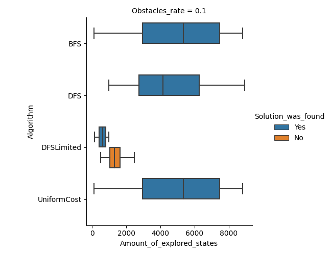
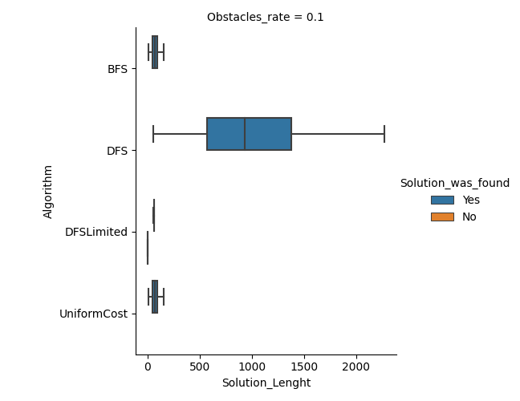
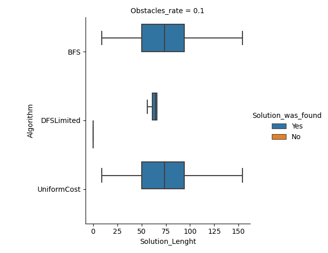

## Martín Cogo Belver
 
# Resultados:
 
Resultado de 30 iteraciones donde se prueban 3 algoritmos de búsqueda no informada sobre un entorno con generación aleatoria de obstáculos.  
 
Environment_size=100x100  
obstacules_rate=0.1  
limit for DFS limited = 100*2/3 = 66
 
## Media Aritmética y Desviación Estándar de los resultados
 
#### Mean:  
 
Solution_Lenght=                52.688889  
Amount_of_explored_states=    3566.300000  
 
#### Standard Deviation:
 
Solution_Lenght=              4.643625e+01  
Amount_of_explored_states=    2.918678e+03  
 
## Comparando la *cantidad totales de estados alcanzados*
 
Comparación de la cantidad de estados explorados antes de encontrar la solución.
 

 
### Observaciones
 
+ Los algoritmos BFS y UniformCost en este caso tienen el mismo rendimiento ya que el costo del desplazamiento de una posición a otra es 1 en todos los casos en este problema .
+ Se puede observar que el mínimo de estados explorados por DFS es mayor comparados con los demás.
+ En el caso del DFS Limitado no puede hallar soluciones a ningún objetivo que esté fuera del límite.
+ Las soluciones que se encuentran por DFS Limited requieren menor cantidad de estados explorados.
+ Con DFSLimited se exploran muchos más estados cuando la solución no puede encontrarse pero son muchísimos menos que los demás algoritmos debido al límite elegido.
 
 
## Comparando el tamaño de las *Soluciones*
 
Comparación de la cantidad de estados necesarios para llegar al objetivo:  
obstacules_rate=0.1 limit for DFS limited = 100*2/3 = 66
 

 

 
### Observaciones
 
+ Las soluciones por DFS no son óptimas, ni una buena solución al problema.
+ Las Soluciones encontradas por el DFS Limited son subóptimas pero y se encuentran con un tamaño cercano al límite definido.
+ Aquellas soluciones fuera del límite no son encontradas por DFSLimited.
+ Las soluciones óptimas solo son presentadas por BFS y UniformCost.
 
## Conclusion:
 
+ La complejidad temporal del algoritmo DFS es mucho más elevada que los demás, y sus soluciones no son óptimas.
+ Tanto la complejidad temporal de BFS y UniformCost en este problema es idéntica.
+ BFS y UniformCost brindan una solución óptima.
+ DFSLimited presenta soluciones subóptimas con una cantidad de estados cercanos al límite. Pero la complejidad temporal es mucho menor que los demás algoritmos. Sin embargo, aquellos objetivos fuera del límite resultan inalcanzables.
