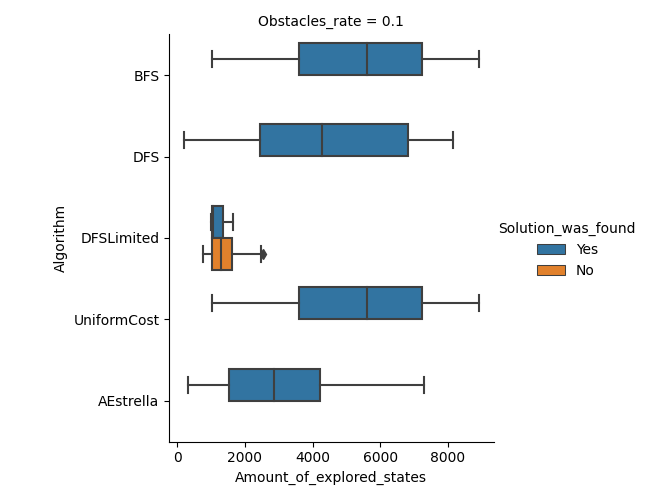
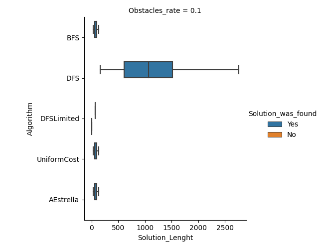
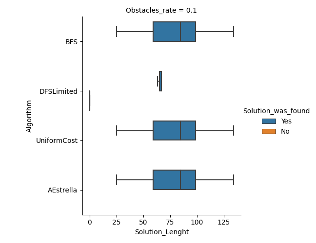

## Martín Cogo Belver
 
# Resultados:
 
Resultado de 30 iteraciones donde se prueban 3 algoritmos de búsqueda no informada sobre un entorno con generación aleatoria de obstáculos.  
 
Environment_size=100x100  
obstacules_rate=0.1  
limit for DFS limited = 100*2/3 = 66
Heurística: **Distancia Euclidiana**
 
## Media Aritmética y Desviación Estándar de los resultados
 
### Mean:
Solution_Lenght               279.82
Amount_of_explored_states    3913.60
 
### Standard Deviation:
Solution_Lenght              5.445337e+02
Amount_of_explored_states    2.460067e+03
 
## Comparando la *cantidad totales de estados alcanzados*
 
Comparación de la cantidad de estados explorados antes de encontrar la solución.
 

 
### Observaciones
 
+ El Algoritmo A* tiene una menor complejidad temporal que BFS y UniforCost.
 
## Comparando el tamaño de las *Soluciones*
 
Comparación de la cantidad de estados necesarios para llegar al objetivo:  
obstacules_rate=0.1 limit for DFS limited = 100*2/3 = 66
 

 

 
### Observaciones
 
+ Las soluciones por DFS no son óptimas, ni una buena solución al problema.
+ Las soluciones de A*, BFS y Uniform Cost son óptimas.
 
## Conclusion:
 
+ A* Se desempeña de manera más óptima comparada con Uniform Cost y BFS debido a la heurística.
 