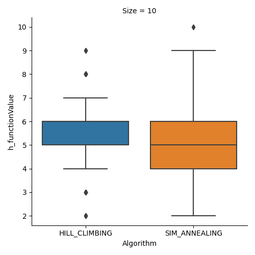
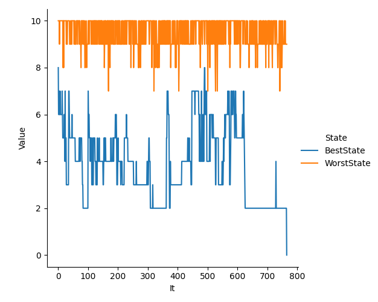

## Martín Cogo Belver
# Inteligencia Artificial 1
## Trabajo Practico 5
### Algoritmos de Busqueda local

## Graphics

### Threatened Queens BoxPlot

### Algorithm Time BoxPlot

### Explored States BoxPlot 

### h() function BoxPlot

### Genetic Algorithm h() function Max Score and Min Score of popuplation on each iteration

# Analysis of Results:
<table><caption>Results</caption><thead><tr><th>Size</th><th>Hill Climbing</th><th>Simmulated Annealing</th><th>Genetic Algorithm</th></tr></thead><tbody><tr><td>4</td><td>Mean:

<ul><li>Threatened_Queens = 1.333

</li><li>Amount_of_explored_states = 1.7

</li><li>Time = 0.001

</li></ul>Starndar Deviation:

<ul><li>Threatened_Queens = 1.193

</li><li>Amount_of_explored_states = 0.823

</li><li>Time = 0.0

</li></ul>Percentage of optimal solutions = 0.044
</td><td>Mean:

<ul><li>Threatened_Queens = 0.0

</li><li>Amount_of_explored_states = 51.367

</li><li>Time = 0.001

</li></ul>Starndar Deviation:

<ul><li>Threatened_Queens = 0.0

</li><li>Amount_of_explored_states = 35.808

</li><li>Time = 0.001

</li></ul>Percentage of optimal solutions = 0.111
</td><td>Mean:

<ul><li>Threatened_Queens = 0.0

</li><li>Amount_of_explored_states = 89.333

</li><li>Time = 0.016

</li></ul>Starndar Deviation:

<ul><li>Threatened_Queens = 0.0

</li><li>Amount_of_explored_states = 78.651

</li><li>Time = 0.029

</li></ul>Percentage of optimal solutions = 0.111
</td></tr><tr><td>8</td><td>Mean:

<ul><li>Threatened_Queens = 2.2

</li><li>Amount_of_explored_states = 3.333

</li><li>Time = 0.046

</li></ul>Starndar Deviation:

<ul><li>Threatened_Queens = 1.108

</li><li>Amount_of_explored_states = 1.193

</li><li>Time = 0.015

</li></ul>Percentage of optimal solutions = 0.015
</td><td>Mean:

<ul><li>Threatened_Queens = 1.167

</li><li>Amount_of_explored_states = 519.967

</li><li>Time = 0.119

</li></ul>Starndar Deviation:

<ul><li>Threatened_Queens = 1.035

</li><li>Amount_of_explored_states = 228.158

</li><li>Time = 0.053

</li></ul>Percentage of optimal solutions = 0.048
</td><td>Mean:

<ul><li>Threatened_Queens = 0.167

</li><li>Amount_of_explored_states = 3664.8

</li><li>Time = 2.476

</li></ul>Starndar Deviation:

<ul><li>Threatened_Queens = 0.898

</li><li>Amount_of_explored_states = 3861.022

</li><li>Time = 2.585

</li></ul>Percentage of optimal solutions = 0.107
</td></tr><tr><td>10</td><td>Mean:

<ul><li>Threatened_Queens = 2.667

</li><li>Amount_of_explored_states = 3.9

</li><li>Time = 0.079

</li></ul>Starndar Deviation:

<ul><li>Threatened_Queens = 1.075

</li><li>Amount_of_explored_states = 0.978

</li><li>Time = 0.025

</li></ul>Percentage of optimal solutions = 0.004
</td><td>Mean:

<ul><li>Threatened_Queens = 1.6

</li><li>Amount_of_explored_states = 631.2

</li><li>Time = 0.127

</li></ul>Starndar Deviation:

<ul><li>Threatened_Queens = 0.917

</li><li>Amount_of_explored_states = 164.439

</li><li>Time = 0.065

</li></ul>Percentage of optimal solutions = 0.026
</td><td>Mean:

<ul><li>Threatened_Queens = 1.4

</li><li>Amount_of_explored_states = 13224.667

</li><li>Time = 8.867

</li></ul>Starndar Deviation:

<ul><li>Threatened_Queens = 1.943

</li><li>Amount_of_explored_states = 7420.912

</li><li>Time = 6.111

</li></ul>Percentage of optimal solutions = 0.067
</td></tr></tbody></table>

## Conclusión:
    El mejor algoritmo para resolver este tipo de problemas es el algoritmo genético, aunque este lleva mayor cantidad de tiempo de ajuste de parámetros para lograr encontrar soluciones óptimas y un mayor tiempo de ejecución. Aun así es altamente paralelizable, por lo que puede lograrse mejor rendimiento.