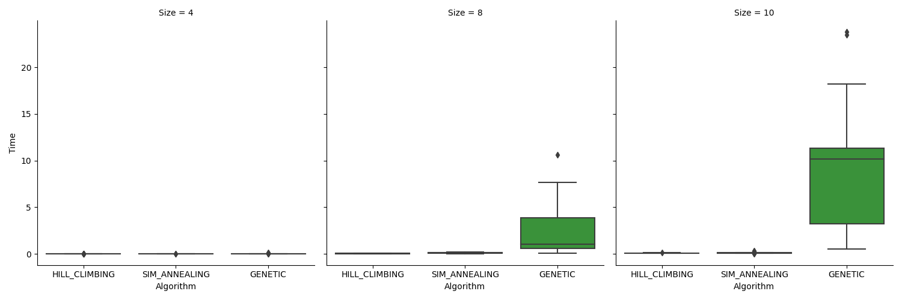

## Martín Cogo Belver
# Inteligencia Artificial 1
## Trabajo Practico 5
### Algoritmos de Busqueda local

<table><caption>Results</caption><thead><tr><th>Size</th><th>Hill Climbing</th><th>Simmulated Annealing</th><th>Genetic Algorithm</th></tr></thead><tbody><tr><td>4</td><td>Mean:

<ul><li>Threatened_Queens = 1.3333333333333333

</li><li>Amount_of_explored_states = 1.4333333333333333

</li><li>Time = 0.0011995712916056315

</li></ul>Starndar Deviation:

<ul><li>Threatened_Queens = 1.1925695879998877

</li><li>Amount_of_explored_states = 0.8439325934114775

</li><li>Time = 0.0005526930670991191

</li></ul>Percentage of optimal solutions = 0.02666666666666667
</td><td>Mean:

<ul><li>Threatened_Queens = 0.4

</li><li>Amount_of_explored_states = 34.0

</li><li>Time = 0.0009050687154134114

</li></ul>Starndar Deviation:

<ul><li>Threatened_Queens = 0.8000000000000002

</li><li>Amount_of_explored_states = 21.624060673240816

</li><li>Time = 0.0011982429375489987

</li></ul>Percentage of optimal solutions = 0.05333333333333334
</td><td>Mean:

<ul><li>Threatened_Queens = 2.9

</li><li>Amount_of_explored_states = 40.0

</li><li>Time = 0.026604318618774415

</li></ul>Starndar Deviation:

<ul><li>Threatened_Queens = 0.7895146188218007

</li><li>Amount_of_explored_states = 0.0

</li><li>Time = 0.04106405640679817

</li></ul>Percentage of optimal solutions = 0.0
</td></tr><tr><td>8</td><td>Mean:

<ul><li>Threatened_Queens = 2.2

</li><li>Amount_of_explored_states = 3.566666666666667

</li><li>Time = 0.11556371053059895

</li></ul>Starndar Deviation:

<ul><li>Threatened_Queens = 1.1075498483890767

</li><li>Amount_of_explored_states = 1.085766498326822

</li><li>Time = 0.06545354025123448

</li></ul>Percentage of optimal solutions = 0.008888888888888889
</td><td>Mean:

<ul><li>Threatened_Queens = 2.2

</li><li>Amount_of_explored_states = 81.36666666666666

</li><li>Time = 0.039042210578918456

</li></ul>Starndar Deviation:

<ul><li>Threatened_Queens = 0.653197264742181

</li><li>Amount_of_explored_states = 16.787859369860776

</li><li>Time = 0.05119646077785581

</li></ul>Percentage of optimal solutions = 0.0022222222222222222
</td><td>Mean:

<ul><li>Threatened_Queens = 5.566666666666666

</li><li>Amount_of_explored_states = 80.0

</li><li>Time = 0.3593752861022949

</li></ul>Starndar Deviation:

<ul><li>Threatened_Queens = 0.667499479816693

</li><li>Amount_of_explored_states = 0.0

</li><li>Time = 0.11491372012119327

</li></ul>Percentage of optimal solutions = 0.0
</td></tr><tr><td>10</td><td>Mean:

<ul><li>Threatened_Queens = 2.7666666666666666

</li><li>Amount_of_explored_states = 3.7

</li><li>Time = 0.25612397988637287

</li></ul>Starndar Deviation:

<ul><li>Threatened_Queens = 1.358512258154322

</li><li>Amount_of_explored_states = 1.2151817422372124

</li><li>Time = 0.09640307082149113

</li></ul>Percentage of optimal solutions = 0.006666666666666667
</td><td>Mean:

<ul><li>Threatened_Queens = 2.8666666666666667

</li><li>Amount_of_explored_states = 110.6

</li><li>Time = 0.07238285541534424

</li></ul>Starndar Deviation:

<ul><li>Threatened_Queens = 0.9910712498212337

</li><li>Amount_of_explored_states = 25.30296425322535

</li><li>Time = 0.048522252334472986

</li></ul>Percentage of optimal solutions = 0.0022222222222222222
</td><td>Mean:

<ul><li>Threatened_Queens = 7.066666666666666

</li><li>Amount_of_explored_states = 100.0

</li><li>Time = 0.7569469849268595

</li></ul>Starndar Deviation:

<ul><li>Threatened_Queens = 0.7272474743090478

</li><li>Amount_of_explored_states = 0.0

</li><li>Time = 0.1968663862878912

</li></ul>Percentage of optimal solutions = 0.0
</td></tr><tr><td>12</td><td>Mean:

<ul><li>Threatened_Queens = 2.4

</li><li>Amount_of_explored_states = 5.466666666666667

</li><li>Time = 0.632086165746053

</li></ul>Starndar Deviation:

<ul><li>Threatened_Queens = 1.3063945294843615

</li><li>Amount_of_explored_states = 1.5648926125740672

</li><li>Time = 0.2781480564213816

</li></ul>Percentage of optimal solutions = 0.006666666666666667
</td><td>Mean:

<ul><li>Threatened_Queens = 4.166666666666667

</li><li>Amount_of_explored_states = 144.93333333333334

</li><li>Time = 0.11235760052998861

</li></ul>Starndar Deviation:

<ul><li>Threatened_Queens = 0.7781745019952502

</li><li>Amount_of_explored_states = 25.910015223632907

</li><li>Time = 0.07210412504374186

</li></ul>Percentage of optimal solutions = 0.0
</td><td>Mean:

<ul><li>Threatened_Queens = 8.8

</li><li>Amount_of_explored_states = 120.0

</li><li>Time = 1.152285925547282

</li></ul>Starndar Deviation:

<ul><li>Threatened_Queens = 1.0132456102380443

</li><li>Amount_of_explored_states = 0.0

</li><li>Time = 0.36203425567956904

</li></ul>Percentage of optimal solutions = 0.0
</td></tr><tr><td>15</td><td>Mean:

<ul><li>Threatened_Queens = 3.2666666666666666

</li><li>Amount_of_explored_states = 6.266666666666667

</li><li>Time = 1.1441880305608114

</li></ul>Starndar Deviation:

<ul><li>Threatened_Queens = 1.3888444437333105

</li><li>Amount_of_explored_states = 1.030641655582687

</li><li>Time = 0.7541828473673227

</li></ul>Percentage of optimal solutions = 0.0044444444444444444
</td><td>Mean:

<ul><li>Threatened_Queens = 4.566666666666666

</li><li>Amount_of_explored_states = 161.96666666666667

</li><li>Time = 0.1328837235768636

</li></ul>Starndar Deviation:

<ul><li>Threatened_Queens = 0.9551032521262935

</li><li>Amount_of_explored_states = 25.951857137570887

</li><li>Time = 0.10387078043388381

</li></ul>Percentage of optimal solutions = 0.0
</td><td>Mean:

<ul><li>Threatened_Queens = 11.066666666666666

</li><li>Amount_of_explored_states = 150.0

</li><li>Time = 1.714727814992269

</li></ul>Starndar Deviation:

<ul><li>Threatened_Queens = 0.9285592184789413

</li><li>Amount_of_explored_states = 0.0

</li><li>Time = 0.9379308587261417

</li></ul>Percentage of optimal solutions = 0.0
</td></tr></tbody></table>

## Grafics
### Explored States BoxPlot 

### Threatened Queens BoxPlot

### Algorithm Time BoxPlot
