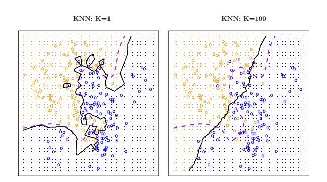

# Inteligencia Artificial #

## Martín Cogo Belverw ##

## TP 7 parte 1 ##

## Respuestas a preguntas del texto [ISLRv2](https://hastie.su.domains/ISLRv2_website.pdf) ##

1. ###  Indicar cuando se esperaría generalmente que el rendimiento de un método de aprendizaje estadístico flexible es mejor o peor que un método inflexible ###

#### a) El tamaño de la muestra $n$ es extremadamente grande, y el numero de predictores $p$ es pequeño ########

En este caso el rendimiento de un método flexible debería ser **mejor** que el de un método inflexible.  
Utilizar un método flexible resultara en una curva con una forma más aproximadamente parecida a la del $f(X)$ real debido a la gran cantidad de muestras, aun que se corre el peligro de caer en *overfitting*.

#### b) El numero de predictores $p$ es extremadamente grande,y el tamaño de la muestra $n$ es pequeño ####

En este caso el rendimiento de un método flexible debería ser **peor** que el de un método inflexible.  
Utilizar un método inflexible resultara en una curva que no se adapte tanto a la forma real de $f(x)$ pero fácilmente calculable comparado con un método flexible, pero se corre el peligro de que la aproximación sea pobre.

#### c) La relación entre los predicadores y la respuesta es altamente no lineal ####

En este caso el rendimiento de un método flexible debería ser **mejor** que el de un método inflexible.  
Utilizar un método flexible resultara en una curva con una forma más aproximadamente parecida a la del $f(X)$ real debido a que no se realiza una estimación de la forma de la curva como si se realiza con los métodos inflexibles.

#### d) La varianza del termino de error, ej. $\sigma^2 = Var(\epsilon)$ es extremadamente alta ####

En este caso el rendimiento de un método flexible debería ser **mejor** que el de un método inflexible. Debido a que la variación del error es alta podría caerse en un problema de aproximación pobre.

2. ### Explorar para cada escenario si se trata de un problema de regresión o clasificación, e indicar cuando estamos más interesados en la inferencia o la predicción.Finalmente, provea $n$ y $p$ ###

#### a) Recolectamos un conjunto de datos en el top 500 de firmas de US. Para cada firma registramos lucro, numero de empleados, el salario en la industria y el del CEO. Estamos interesados en entender que factores afectan el salario del CEO ####

Se trata de un problema de regresión donde se pone foco en la inferencia y los valores son: $n = 500, p = 5$.

#### b) Estamos considerando lanzar un nuevo producto y deseamos saber si será un *éxito* o un *fracaso*. Recolectamos datos sobre 20 productos similares que previamente se lanzaron. Para cada producto se registro cual fue un éxito o fracaso, el precio cobrado por el producto, el gasto en marketing, el precio de competencia y otras 10 variables ####

Se trata de un problema de clasificación donde interesa más la predicción y los valores son: $n = 20, p = 14$

#### c) Estamos interesados en predecir el cambio porcentual de la razón de cambio USD/Euro en relación con los rápidos cambios en el mercado de valores mundial. Para ello recolectamos semanalmente datos durante todo el 2012. Por cada semana registramos la tasa de cambio porcentual del intercambio USD/Euro, el cambio porcentual en el mercado de US, el cambio porcentual en el mercado británico, y el cambio porcentual en el mercado alemán ####

Se trata de un problema de regresión donde interesa más la predicción y los valores son: $n = 48, p = 4$

5. ### ¿Cuales son las ventajas y desventajas de una aproximación muy flexible por regresión o por clasificación? ¿Bajo que circunstancias posiblemente sea preferible una aproximación mas flexible a una aproximación menos flexible? ¿Cuando será preferible una aproximación menos flexible? ###

La flexibilidad de un método tiene que ver con que tanto se **restrinja** la cantidad de formas posibles que puede tomar **la curva** que aproximara la función verdadera $f(X)$.

Se prefiere una aproximación **muy flexible** con problemas con una *muestra de gran tamaño y pequeña cantidad variables*, ya que encontrar la curva o superficie que permita una mejor estimación si se busca sin suponer su forma.

Por el contrario, la ventaja de una aproximación **menos flexible** resulta en un error menor al aproximar problemas con *pequeña cantidad de muestras y gran cantidad de variables*. Ya que presuponer la forma de la curva o superficie resulta más sencillo debido a la cantidad de variables.  

También, es preferible una aproximación más flexible cuando **la varianza del error es alta**, si se utilizara una menos flexible se caería en el problema de una aproximación pobre.  

6. ### Describir las diferencias entre aproximación de aprendizaje estadístico paramétrico y no paramétrico. ¿Cuales son las ventajas de la aproximación paramétrica para regresión o clasificación?¿Cuales son las desventajas? ###

La aproximación paramétrica reduce el problema de estimar $f$ al de estimar un conjunto de parámetros asumiendo una forma para la curva $f$ que simplifique el problema.Esto resulta en una ventaja comparado con la aproximación no-paramétrica ya que los valores siempre serán aproximados eliminando la posibilidad de *overfitting*.

Aun así, la aproximación paramétrica corre el riesgo de dar *una aproximación pobre* debido a que la forma de la curva es muy diferente a la supuesta por la aproximación. En este caso la aproximación no-paramétrica resulta en una mejor aproximación ya que no se presupone la forma de la curva.

7. ### La siguiente tabla provee un conjunto de entrenamiento con 6 observaciones, 3 predictores y una respuesta cualitativa ###

|Obs.|$X_1$|$X_2$|$X_3$|$Y$|
|:--:|:---:|:---:|:---:|:-:|
|1|0|3|0|Red|
|2|2|0|0|Red|
|3|0|1|3|Red|
|4|0|1|2|Green|
|5|-1|0|1|Green|
|6|1|1|1|Red|

Suponga que deseamos usar este data set para realizar predicciones para $Y$ cuando $X_1=X_2=X_3=0$ utilizando el vecino más K-cercano.

$$Pr(Y=j|X=x_0)=\dfrac{1}{K}\sum_{i \in N_0}^{K} I(y_i=j) $$

Donde $j$ es el resultado estimado, $x_0$ es un punto muestra, $K$ es un numero constante, y $N_0$ es el conjunto de respuestas de los K-neighbors más cercanos a $x_0$ y $I(y_i=j)$ es una variable indicadora que devuelve 1 si $y_i$ es igual a $j$.

#### a) Calcule la distancia Euclidiana entre cada observación y el punto de prueba, $X_1=X_2=X_3=0$ ####
|Obs.|$X_1$|$X_2$|$X_3$|$Y$|Euclidean distance|
|:--:|:---:|:---:|:---:|:-:|:----------------:|
|1|0|3|0|$\textcolor{Red}{Red}$|$\sqrt{0^2+3^2+0^2}=3$|
|2|2|0|0|$\textcolor{Red}{Red}$|$\sqrt{2^2+0^2+0^2}=2$|
|3|0|1|3|$\textcolor{Red}{Red}$|$\sqrt{0^2+1^2+3^2}=\sqrt{10}$|
|4|0|1|2|$\textcolor{Green}{Green}$|$\sqrt{0^2+1^2+2^2}=\sqrt{5}$|
|5|-1|0|1|$\textcolor{Green}{Green}$|$\sqrt{(-1)^2+0^2+1^2}=\sqrt{2}$|
|6|1|1|1|$\textcolor{Red}{Red}$|$\sqrt{1^2+1^2+1^2}=\sqrt{3}$ |

#### b) ¿Cual es nuestra predicción con $K=1$? ####

Debido a que la observación con menor distancia euclidiana con el punto de prueba es la observación 5 y que $f(-1,0,1)=\textcolor{Green}{Green}$ entonces :

$N_0 =\{\textcolor{Green}{Green}\}$.  

Para $j = \textcolor{Red}{Red}$ y $x_0=(0,0,0)$

$$\begin{align*}
Pr(Y=\textcolor{Red}{Red}|X=(0,0,0)) &=\dfrac{1}{1}\sum_{i \in N_0}^{1} I(y_i=\textcolor{Red}{Red}) \\
&= 1 * I(\textcolor{Green}{Green}=\textcolor{Red}{Red}) \\
&= 1*0 = 0 
\end{align*}$$

Para $j = \textcolor{Green}{Green}$ y $x_0=(0,0,0)$

$$\begin{align*}
Pr(Y=\textcolor{Green}{Green}|X=(0,0,0)) &= \dfrac{1}{1}\sum_{i \in N_0}^{1} I(y_i=\textcolor{Green}{Green}) \\
&= 1 * I(\textcolor{Green}{Green}=\textcolor{Green}{Green}) \\
&= 1*1 = 1 
\end{align*}$$

Predecimos entonces:

|$X_1$|$X_2$|$X_3$|$Y$|
|:---:|:---:|:---:|:-:|
|0|0|0|$\textcolor{Green}{Green}$|  

#### c) ¿Cual es nuestra predicción con $K = 3$? ####

Debido a que la observación con menor distancia euclidiana con el punto de prueba es la observación 5 que $ f(-1,0,1)=\textcolor{Green}{Green}$, luego está la observación 6 que $f(1,1,1)=\textcolor{Red}{Red}$ y por ultimo la observación que 2 que $f(2,0,0)=\textcolor{Red}{Red}$ entonces:

$N_0 =\{\textcolor{Green}{Green},\textcolor{Red}{Red},\textcolor{Red}{Red}\}$.  

Para $j = \textcolor{Red}{Red}$ y $x_0=(0,0,0)$

$$\begin{align*}
Pr(Y=\textcolor{Red}{Red}|X=(0,0,0)) &=\dfrac{1}{3}\sum_{i \in N_0}^{3} I(y_i=\textcolor{Red}{Red}) \\
&= \dfrac{1}{3} * ( I(\textcolor{Green}{Green}=\textcolor{Red}{Red}) + I(\textcolor{Red}{Red}=\textcolor{Red}{Red}) + I(\textcolor{Red}{Red}=\textcolor{Red}{Red}) ) \\
&= \dfrac{1}{3} * (0+1+1) = \dfrac{2}{3}
\end{align*}$$

Para $j = \textcolor{Green}{Green}$ y $x_0=(0,0,0)$

$$\begin{align*}
Pr(Y=\textcolor{Green}{Green}|X=(0,0,0)) &=\dfrac{1}{3}\sum_{i \in N_0}^{3} I(y_i=\textcolor{Green}{Green}) \\
&= \dfrac{1}{3} * ( I(\textcolor{Green}{Green}=\textcolor{Green}{Green}) + I(\textcolor{Red}{Red}=\textcolor{Green}{Green}) + I(\textcolor{Red}{Red}=\textcolor{Green}{Green}) ) \\
&= \dfrac{1}{3} * (1+0+0) = \dfrac{1}{3}
\end{align*}$$

Predecimos entonces:

|$X_1$|$X_2$|$X_3$|$Y$|
|:---:|:---:|:---:|:-:|
|0|0|0|$\textcolor{Red}{Red}$|  

#### d) Si los limites de decision de Bayes en este problema son altamente no lineales, entonce ¿podríamos esperar que el *mejor* valor para $K$ sea grande o pequeño? Por que? ####  

Debido a que mientras mayor es $K$ la aproximación comienza a ser menos flexible y por ende dar aproximaciones con mayor grado de error.
Al este problema ser altamente no lineal es esperable que el $K$ sea ***pequeño***.
Un ejemplo del punto ilustrado:
  
