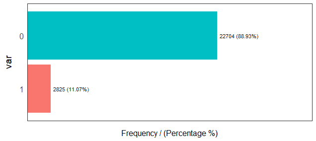
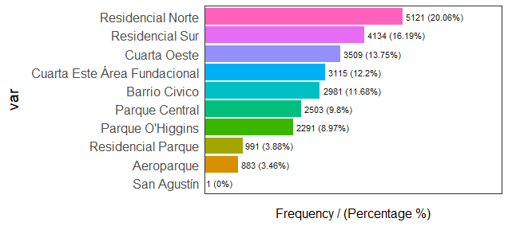
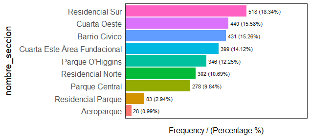
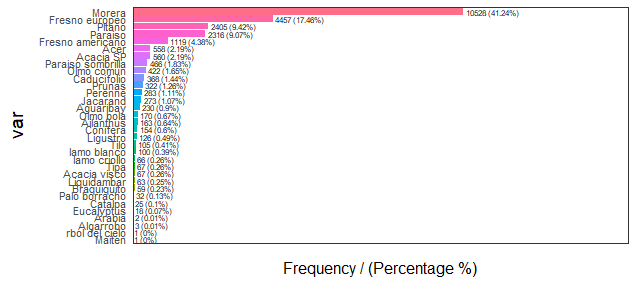
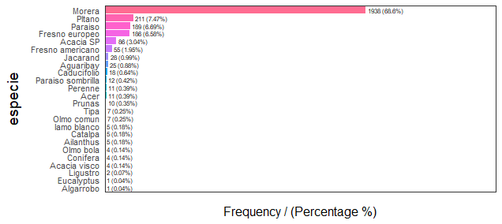
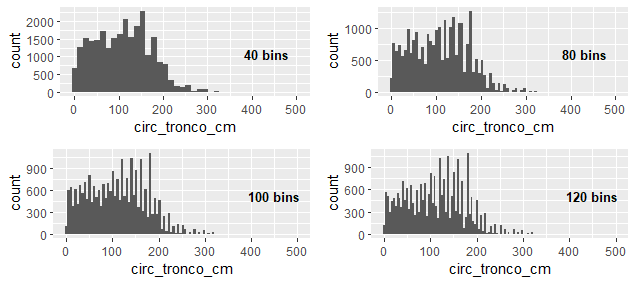
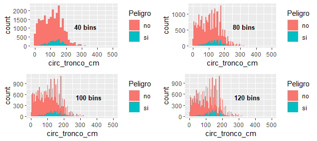

# Respuestas a TP7 #

## Punto 2 ##

### a. Cual es la distribución de las clase inclinacion_peligrosa? ###

Se trata de una distribución binomial donde `n = 31912` y `p = 0.1128`. Pero se puede aproximar a una normal si se cumple que `np >= 5` y `n*(1-p) >= 5`. Como `np = 2880` y `n*(1-p) = 22648`, se puede aproximar con una distribución normal

### b. ¿Se puede considerar alguna sección más peligrosa que otra? ###

  
La mayor cantidad de arboles censados se encuentran en la seccion **Recidencial Norte**.
  
La mayor cantidad de arboles peligrosos censados se encuentran en la seccion **Recidencial Sur**.  
Pero, como la cantidad de arboles censados por sección son desproporcionadas ***no podemos suponer que una zona es más peligrosa que otra*** debido a que si tiene más arboles censados probablemente sea mas peligrosa.

### c. ¿Se puede considerar alguna especie más peligrosa que otra ###

  
La mayor cantidad de arboles censados son **Morera**.
  
La mayor cantidad de arboles peligrosos censados son **Morera**.  
Pero, como la cantidad de arboles censados por especie son desproporcionadas ***no podemos suponer que una especie es más peligrosa que otra*** debido a que si tiene más arboles censados probablemente sea mas peligrosa. 

## Punto 3 ##

### Punto 3.2 y 3.3 ###

### Punto 3.4 ###

Consideré como criterio de corte:

+ **bajo** entre 0 y 100 cm
+ **medio** entre 100 y 200 cm
+ **alto**  entre 200 y 300 cm
+ **muy alto** mayor 300 cm
