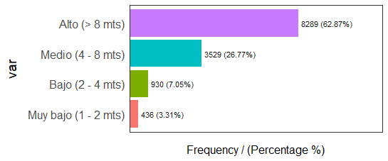

# Estrategia para desafió kaggle #

## Preprocesamiento ## 

Se elimino la variable fecha de modificación.
Se cambiaron todas las variables categóricas con factor.
Se creo la variable circ_tronco_cat, diametro_tronco_cm y altura_rareza.
altura_rareza es una variable categórica que clasifica a cada árbol en "común","normal","raro" y "muy raro" según con que frecuencia tiene su altura ("muy baja","baja","media" y "alta") comparado con arboles de la misma especie.  

Por ejemplo:

En este caso diríamos que todos los arboles de especie *Morera* con una altura *Alta* son *Comunes*,con una altura *Media* son *normales* ,con una altura *baja* son *raros*  y con una altura *muy baja* son *muy raros*.

## Resultados obtenidos en kaggle ##

Los Resultados obtenidos en kaggle se encuentran entre **0.43** y **0.68**.  

|Prueba|Puntaje| 
|---|---|  
|arbolado-mza-dataset-envio-15.csv|0.677|
|arbolado-mza-dataset-envio-14.csv|0.68107|
|arbolado-mza-dataset-envio-13.csv|0.68136|
|arbolado-mza-dataset-envio-12.csv|0.33714|
|arbolado-mza-dataset-envio-10.csv|0.65367|
|arbolado-mza-dataset-envio-9.csv|0.65023|
|arbolado-mza-dataset-envio-8.csv|0.5|
|arbolado-mza-dataset-envio-7.csv|0.62249|
|arbolado-mza-dataset-envio-6.csv|0.59487|
|arbolado-mza-dataset-envio-5.csv|0.56097|
|arbolado-mza-dataset-envio-4.csv|0.64423|
|arbolado-mza-dataset-envio-3.csv|0.49994|
|arbolado-mza-dataset-envio-2.csv|0.52027|
|arbolado-mza-dataset-envio-1.csv|0.5022|

## Resultados sobre el conjunto de validación ## 

|   [,1]        |      [,2]    |             [,3]        |         [,4] |  
|-|-|-|-|
|f1 "6380"       |     "Predicted Positive"| "Predicted Negative"| "total"|
|f2 "Actual Positive"| "393"             |   "287"           |     "0.578"|
|f3 "Actual Negative" |"1276"           |    "4424"           |    "0.224"|
|f4 "total"           |"0.235"         |     "0.061"           |   "0.755"|

## Algoritmo ##

El algoritmo utilizado realiza los siguiente pasos:

1. Primero importa los dataset de entrenamiento.
2. Transforma todas las variables categóricas a factor y elimina la variable de ultima modificación.
3. Realiza el preprocesamiento agregando las 3 nuevas variables circ_tronco_cat, diametro_tronco_cm y rareza_de_altura.
4. Guarda un CSV con los datos procesados.
5. Genera un dataset de entrenamiento y validación iterativamente cumpliendo que exista dentro del conjunto de training arboles que contengan todos los niveles de las variables categóricas.
6. Configura los folds que se utilizaran en el 3-cross-validation y la estrategia de resampling SMOTE.
7. Se configuran los parámetros para el ctree2 de caret.
8. Se envía todo a la función train  y se genera el modelo.
9. Se realiza una predicción sobre el conjunto de validación y se calcula la matriz de confusion.
10. Si los resultados previos son buenos se realiza la predicción sobre el dataset de TEST y se realiza un submit.  